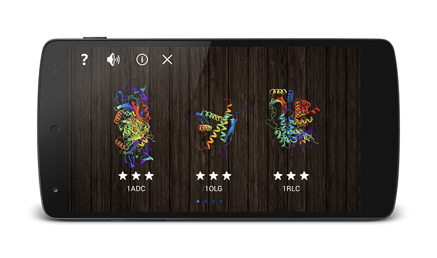

# The Bioinformatics Game (TBG) 

The Binformatics game is fun role play where the player needs to build his own proteins from their amino acid sequence. While learning about enzymes that “ceaselessly battle the champagne you consumed on New Year’s eve”, he has to tackle some obstacles on his way to ultimate glory!

The Bioinformatics game is available for iOS and Android: 

Kindly sponsored by [@rostlab](https://github.com/Rostlab). 
